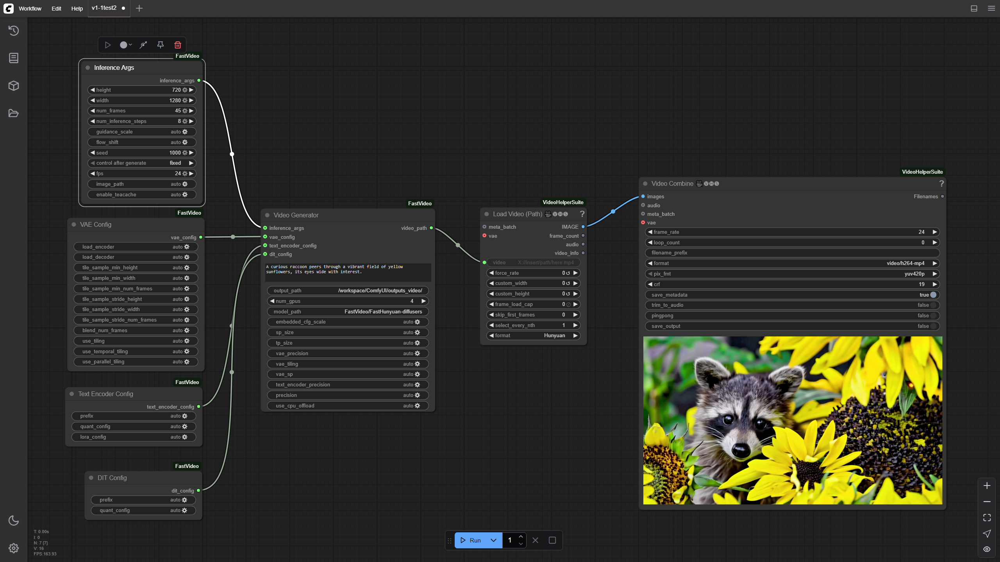
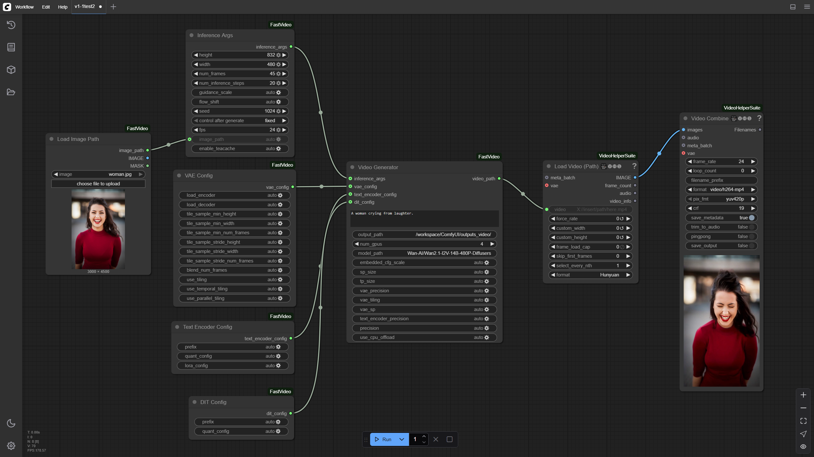

# ComfyUI-FastVideo

A custom node suite for ComfyUI that provides accelerated video generation using [FastVideo](https://github.com/hao-ai-labs/FastVideo). See the [blog post](https://hao-ai-lab.github.io/blogs/fastvideo/) about FastVideo V1 to learn more.

## Multi-GPU Parallel Inference

One of the key features ComfyUI-FastVideo brings to ComfyUI is its ability to distribute the generation workload across multiple GPUs, resulting in significantly faster inference times.


Example of Wan2.1-I2V-14B-480P-Diffusers model running on 4 GPUs.
## Features

- Generate high-quality videos from text prompts and images
- Configurable video parameters (prompt, resolution, frame count, FPS)
- Support for multiple GPUs with tensor and sequence parallelism
- Advanced configuration options for VAE, Text Encoder, and DIT components
- Interruption/cancellation support for long-running generations

## Installation

### Requirements

- [ComfyUI](https://github.com/comfyanonymous/ComfyUI)
- CUDA-capable GPU(s) with sufficient VRAM

### Install using ComfyUI Manager

Coming soon!

### Manual Installation

#### Copy the FastVideo `comfyui` directory into your ComfyUI custom_nodes directory:

```bash
cp -r /path/to/FastVideo/comfyui /path/to/ComfyUI/custom_nodes/FastVideo
```

#### Install dependencies:

Currently, the only dependency is `fastvideo`, which can be installed using pip.

```bash
pip install fastvideo
```

#### Install missing custom nodes:

`ComfyUI-VideoHelperSuite`:

```bash
cd /path/to/ComfyUI/custom_nodes
git clone https://github.com/Kosinkadink/ComfyUI-VideoHelperSuite.git
```

If you're seeing `ImportError: libGL.so.1: cannot open shared object file: No such file or directory`,
you may need to install ffmpeg

```bash
apt-get update && apt-get install ffmpeg
```

## Usage

After installation, the following nodes will be available in the ComfyUI interface under the "fastvideo" category:

- **Video Generator**: The main node for generating videos from prompts
- **Inference Args**: Configure video generation parameters
- **VAE Config**
- **Text Encoder Config**
- **DIT Config**
- **Load Image Path**: Load images for potential conditioning

You may have noticed many arguments on the nodes have 'auto' as the default value. This is because FastVideo will automatically detect the best values for these parameters based on the model and the hardware. However, you can also manually configure these parameters to get the best performance for your specific use case. We plan on releasing more optimized workflow files for different models and hardware configurations in the future.

You can see what some of the default configurations are by looking at the FastVideo repo:
- [Wan2.1-I2V-14B-480P-Diffusers](https://github.com/hao-ai-lab/FastVideo/blob/main/fastvideo/configs/wan_14B_i2v_480p_pipeline.json)
- [FastHunyuan-diffusers](https://github.com/hao-ai-lab/FastVideo/blob/main/fastvideo/configs/fasthunyuan_t2v.json)

### Node Configuration

#### Video Generator

- **prompt**: Text description of the video to generate
- **output_path**: Directory where generated videos will be saved
- **num_gpus**: Number of GPUs to use for generation
- **model_path**: Path to the FastVideo model
- **embedded_cfg_scale**: Classifier-free guidance scale
- **sp_size**: Sequence parallelism size (usually should match num_gpus)
- **tp_size**: Tensor parallelism size (usually should match num_gpus)
- **precision**: Model precision (fp16 or bf16)

`model_path takes either a model id from huggingface or a local path to a model. Models by default will be downloaded to ~/.cache/huggingface/hub/ and cached for subsequent runs.`

#### Inference Args

- **height/width**: Resolution of the output video
- **num_frames**: Number of frames to generate
- **num_inference_steps**: Number of diffusion steps per frame
- **guidance_scale**: Classifier-free guidance scale
- **flow_shift**: Frame flow shift parameter
- **seed**: Random seed for reproducible generation
- **fps**: Frames per second of the output video
- **image_path**: Optional path to input image for conditioning (for i2v models)

## Memory Management

Models will remain loaded in GPU memory between runs when you only change inference arguments (such as prompt, resolution, frame count, FPS, guidance scale, etc.) or the prompt text. This allows for faster subsequent generations since the model doesn't need to be reloaded.

However, if you need to change the following parameters, you will need to restart the ComfyUI server:
- **Number of GPUs** (`num_gpus`)
- **Model path** (`model_path`)
- **Tensor parallelism size** (`tp_size`)
- **Sequence parallelism size** (`sp_size`)

These parameters affect the model's distribution across GPUs and require a complete reinitialization of the model pipeline.

## Example workflows

### Text to Video

FastVideo-FastHunyuan-diffusers



- [FastHunyuan-diffusers.json](./examples/FastHunyuan-diffusers.json)

### Image to Video

Wan2.1-I2V-14B-480P-Diffusers



- [Wan2.1-I2V-14B-480P-Diffusers.json](./examples/Wan2.1-I2V-14B-480P-Diffusers.json)

## License

This project is licensed under Apache 2.0.
